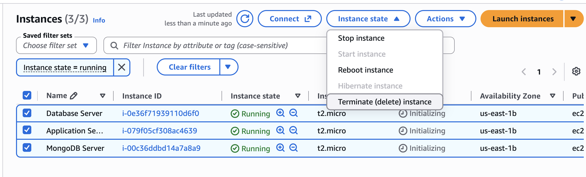
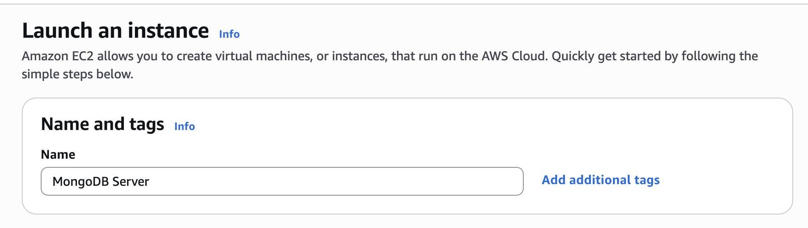
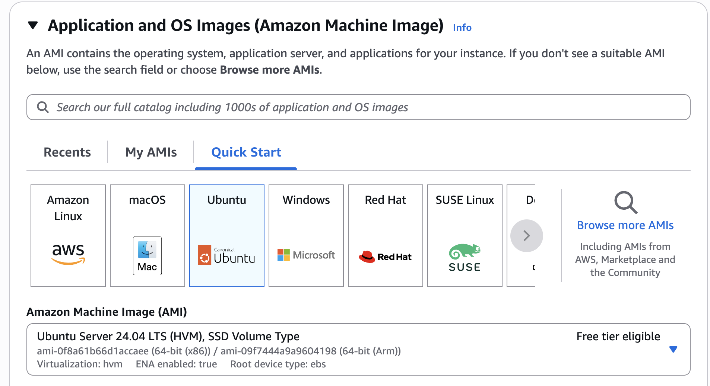
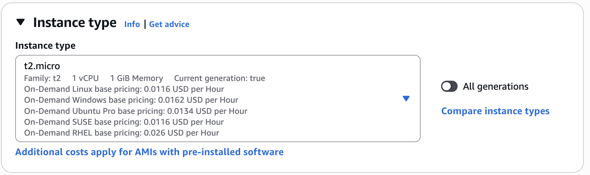
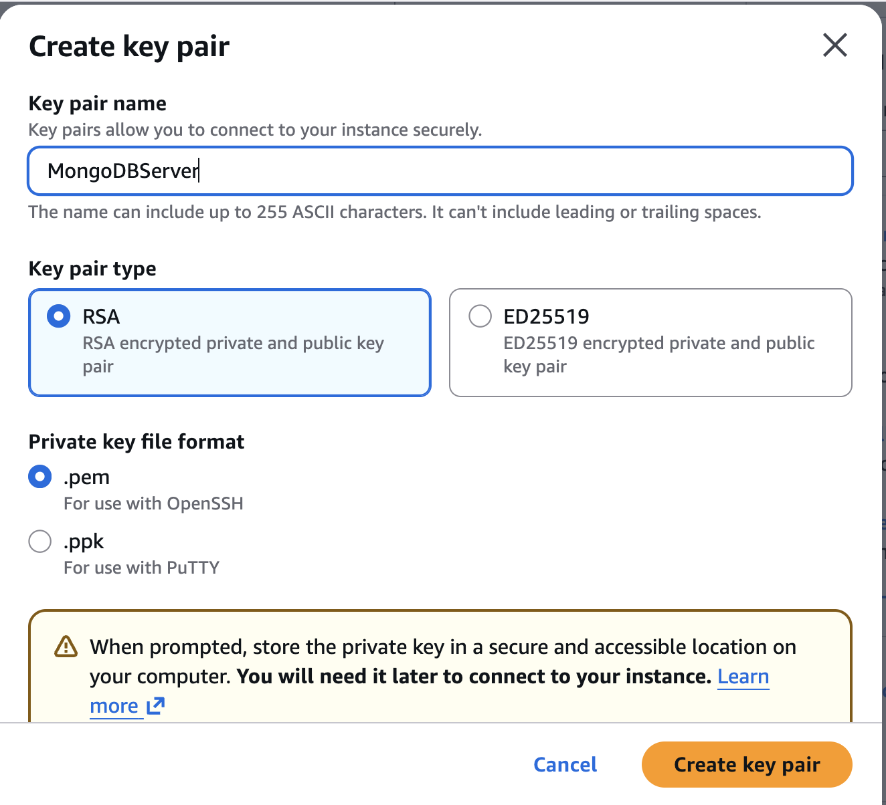
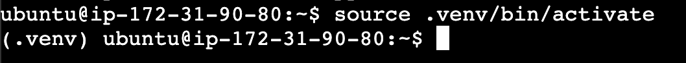
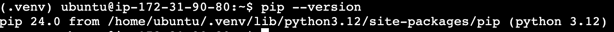
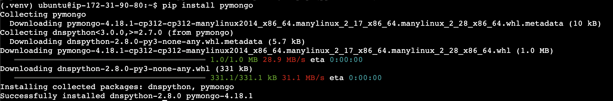

# [00] MongoDB Server Setup

## Introduction

This document will show you how to setup your MongoDB Server in AWS EC2.

## Cleanup

Before everything else let us cleanup whatever we have in EC2. 

1. In the AWS Console, go to EC2 > Instances.
2. Select all running instances > Instance State > Terminate



## Create a New Instance

Now that our old instances are terminated, let us create a new instance which will serve as our new MongoDB Server.

>![NOTE]
> We will no longer have 2 instances/servers. We will access the MongoDB database in its own server to reduce network complexity. Thus, we will only need 1 server.

1. Click on Launch Instances on the upper right corner of the EC2 instances page.
2. Choose a name for your server. In my case, I'll use "MongoDB Server".

3. For Application and OS Images (Amazon Machine Image), choose Ubuntu under the Quick Start tab, then under Amazon Machine Image (AMI), Choose "Ubuntu Server 24.04 LTS (HVM), SSD Volume Type".

>[!WARNING]
> Make sure you are using the right OS and version!
4. Under Instance Type, select "t2.micro".

5. Under Key pair, click "Create new key pair" > Enter a key pair name (any, avoid spaces) > RSA > .pem > Create key pair

>[!IMPORTANT]
> Your key pair should be downloaded. Keep it for future use.
6. Do not modify anything else and click "Launch instance" at the lower right corner.

## Connect to your Instance

To open a terminal that will allow you to access your new server, click go to EC2 > Instance > Select your Instance > Click "Connect". It should be around the upper center part of the console. In the next page, click Connect on the lower right part of the page. The terminal should open.

## Check Python Version
To check python version, run `python3 --version` on the terminal. The result should match the following:

```
Python 3.12.3
```

>[!IMPORTANT]
> If your python version doesn't match the one above, notify the instructor immediately

## Installing Python venv

To install any python library, we must install Python venv and use that whenever we run our python code. To install, run the commands below in your EC2 instance terminal:

```
sudo apt update
sudo apt install python3-venv
```

When prompted, type `y` to proceed with the installation.

Once done, try to create a virtual environment. To do that:

1. Go to `/home/ubuntu` (It should be the detault directory. Run `pwd` to double check the current directory).
2. Run the following command:
```
python3 -m venv .venv
```
3. Finally, let's try to activate the virtual environment by running the following command:
```
source .venv/bin/activate
```
4. Once activated, you should see a (.venv) prefix in your terminal like this:


>[!WARNING]
> Make sure you are in the `/home/ubuntu/` directory when activating venv.

>[!IMPORTANT]
> Whenever you want to run python code with libraries that you installed in the venv, you need to activate the venv first.

## Installing Python Pymongo

1. Activate the venv inside `/home/ubuntu`
2. Check pip version inside the venv by running the command below:
```
pip --version
```


>[!WARNING]
> If the pip version is not the same as the screenshot, notify the instructor immediately!
3. Run the command below to install pymongo:
```
pip install pymongo
```


>[!NOTE]
> The versions may not match, that should be okay.

Pymongo should now be usable inside your venv.

## Installing MongoDB

1. Login to your EC2 instance and access the terminal.
2. Update Your Package Index: Open your terminal and run the following command to update your package index:
```
sudo apt update -y
```
3. Install Required Packages: Install the necessary packages for MongoDB by running this command in the terminal:
```
sudo apt install -y gnupg curl ca-certificates
```
4. Import the MongoDB GPG Key: Import the public GPG key for MongoDB by running this command in the terminal:
```
curl -fsSL https://pgp.mongodb.com/server-7.0.asc | sudo gpg --dearmor -o /usr/share/keyrings/mongodb-server-7.0.gpg
```
5. Create the MongoDB Repository List File: Add the MongoDB repository to your system by running this command in the terminal:
```
echo "deb [ arch=amd64,arm64 signed-by=/usr/share/keyrings/mongodb-server-7.0.gpg ] https://repo.mongodb.org/apt/ubuntu jammy/mongodb-org/7.0 multiverse" | sudo tee /etc/apt/sources.list.d/mongodb-org-7.0.list
```
6. Reload the Local Package Database: Update your package index again to include the MongoDB repository by running this command in the terminal:
```
sudo apt update -y
```
6. Install MongoDB 7.0: Install MongoDB by running this command in the terminal:
```
sudo apt install -y mongodb-org
```
7. Start and Enable MongoDB Service: Start the MongoDB service by running this command in the terminal:
```
sudo systemctl start mongod
```
8. Enable MongoDB to start on boot by running this command in the terminal:
```
sudo systemctl enable mongod
```
8. Now let's test if MongoDB has been succesfully installed. We can use mongosh to interact with your MongoDB deployment. In the terminal, run the following command:
```
mongosh
```
If installation was successful, you should be able to see a prompt that looks something like this:
```
Current Mongosh Log ID: 1234567890abcdef12345678
Connecting to: mongodb://localhost:27017
Using MongoDB: 4.4.0
Using Mongosh: 1.0.0

For mongosh info see: https://docs.mongodb.com/mongodb-shell/

test>
```

This indicates that mongosh has connected to your MongoDB instance and you can start running commands. If you see any errors, it might indicate an issue with the installation or connection.

