# [04] Pymongo CRUD

# Table of Contents

## Introduction

This repo will be used to setup the sample dataset that can be used to apply the lectures on basic Pymongo CRUD operations. You will need to run this first in order to migrate the dateset into your own instance of MongoDB.

## Deleting Existing Data

You may have created the same database in the previous activity that will conflict with this one. Thus, you need to drop that database first. Go to Mongo Shell and run the following commands:

```
use ruralSavingsPrime;
db.dropDatabase();
```

<h2 id=import> Importing Data to MongoDB </h2>

Once you are inside the repository, you can now run the import script which will import database objects into your MongoDB database. Follow these steps:

1. Go to `/home/ubuntu/CSCI112-Course-Pack/lecture_supplements/04-pymongoCRUD/`
2. Run the script: `python3 import.py`

## Reverting to the Original Database State

If you want to revert to the original database state, you can drop the database and execute [Importing Data to MongoDB](#import) from this manual again.

```
use ruralSavingsPrime;
db.dropDatabase();
```

## Code Structure

This specific repo contains 6 python files, each aiming to teach you the syntax of the CRUD operations in Pymongo. This tutorial will go through these files and run them one at a time.

---
---
<br/><br/>

## Pymongo CRUD Tutorial

### Introduction

Pymongo is a python library that simplifies the interaction of a Python code with a MongoDB Database. It has built in functions that would allow the code to connect to a MongoDB Database, query collections, create documents, update documents, and delete documents, among other things.

---

### `connect.py`

On `04-pymongoCRUD` repo, you will see a file called `connect.py`. Open it.

#### Connecting to a MongoDB Database

On line 9, you can see this line of code:

```
conn = pymongo.MongoClient('localhost', 27017)
```

This line of code calls the `MongoClient()` function from `pymongo` to create a connection to the MongoDB Database in localhost on port 27017. The response of this function is stored in the `conn` variable which is the connection object returned if the connection is successful.

>[!IMPORTANT]
> The parameters of the `MongoClient()` function from `pymongo` are the `host` (IP or hostname) and the `port` (usually 27017 depdending on the MongoDB setup)

On line 11, the response is printed.

>[!NOTE]
> **TO DO: Connect to your MongoDB Database and print the connection object returned.**
> 1. Copy and Paste lines 1-11 of `connect.py` to a blank python file in your local VSCode. 
> 2. Complete the code by adding any essential imports, open connection, and close connection code blocks in case they are not present.
> 3. Copy and paste your final code to a blank file in your EC2 server using nano.
> 4. Run the python code by executing `python3 <your_code_filename.py>`
><br><br>
> Expected Output is similar to this screenshot:
> 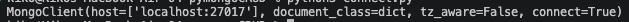

#### Accessing a Database

On line 13, you can see this line of code:

```
db = conn["ruralSavingsTest"]
```

This is the equivalent of running `use ruralSavingsTest` in Mongo Shell.

#### Disconnecting from a MongoDB Database

When you have completed all your operations with the MongoDB Database, it is important to always close the connection so that stale connections are avoided. Stale connections may prevent incoming critical operations from being executed due to connection limits.

On the same python file, go to line 13. The `.close()` function from a connection object closes the existing MongoDB connection.

>[!IMPORTANT]
> Always close any connection that you opened with the MongoClient() function.

---

### `insert.py`

On 04-pymongoCRUD repo, you will see a file called `insert.py`. Open it.

>[!IMPORTANT]
> Important terms to remember:
> dictionary - a python data structure used to hold a JSON-like object
> list - the same as array in other programming languages

If you take a look at lines 1-5, there are new imports added. These are used to import any libraries that are needed to create special numeric types in python before you can insert them in MongoDB.

```
import pymongo
from datetime import datetime
from bson.int64 import Int64
from bson.decimal128 import Decimal128
from decimal import Decimal
```

Before we can start with our operations, we first need to open a connection to our MongoDB databse. We do that online 10 as we learned in the previous section of this tutorial.

```
conn = pymongo.MongoClient("localhost",27017)
```

#### Creating a document before inserting to a MongoDB Collection

To insert a document in MongoDB using pymongo, it's best to create a dictionary first to store your document. See `document1` variable below as an example. This variable contains a sample data for our `ruralSavingsTest.customerAccounts` collection that we intend to insert. This can also be found on lines 13-30 of this script.

```
document1 = {
    "customerNumber": "RSCN01",
    "customerFirstName": "Luka",
    "customerLastName": "Doncic",
    "age": 26,
    "address": {
        "city": "Los Angeles",
        "country": "USA"
    },
    "accounts": [
        {
            "accountNumber": "RSAN01",
            "cardNumber": "123456781234077",
            "creditLimit": 10000000,
            "branch": "Katipunan"
        }
    ]
}
```

Below is another variable, `document2`, that contains sample data for our `ruralSavingsTest.transactions` collection that we intend to insert. This can be found on lines 34-42 of this script.

```
document2 = {
    "transactionNumber": "RSCNTXN00001",
    "customerNumber": "RSCN01",
    "accountNumber": "RSAN01",
    "type": "debit",
    "amount": 250,
    "vendor": "Potato Corner",
    "transactionDate": datetime(2025,8,31)
}
```

>[!IMPORTANT]
> Notice in `document2`, `transactionDate`'s value is `datetime(2025,8,31)`.
> This is a conversion function from the `datetime` library in python.
> When inserting data with special datatypes like dates, decimal 128, long integers, etc., the standard python conversion functions must be used before inserting the data in MongoDB.

Now to actually insert the data into MongoDB, we can either use the `insert_one()` and `insert_many` functions.

Let's try using `insert_one()` first. On line 45, we use the `ruralSavingsTest` database. Then on line 47, we run the `insert_one()` function by passing in our `document1` and `document2` variables.

On lines 47-51, we execute the `insert_one()` function using these lines of code:

```
output1 = db["customerAccounts"].insert_one(document1) #insert document1 to ruralSavingsTest.customerAccounts
output2 = db["transactions"].insert_one(document2) #insert document2 to ruralSavingsTest.transactions

print(output1)
print(output2)
```

We store the output of the commands so that we can print what the responses are.

>[!IMPORTANT]
> 1. Notice how `insert_one()` is run: we use the variable `db` that contains the connection to the MongoDB Database. This is a python dictionary and it also contains the available collections inside the database. One of which is our collection called `customerAccounts`. We access that collection using this syntax: `db["<collection_name">]`.
> 2. The `insert_one()` function accepts a python dictionary as parameter, denoted by `{}`.

>[!NOTE]
> **TO DO: Insert the documents to the collection.**
> 1. Copy and Paste lines 1-51 of `insert.py` to a blank python file in your local VSCode. 
> 2. Complete the code by adding any essential imports, open connection, and close connection code blocks in case they are not present.
> 3. Copy and paste your final code to a blank file in your EC2 server using nano.
> 4. Run the python code by executing `python3 <your_code_filename.py>`
><br><br>
> Expected Output is similar to this screenshot:
> 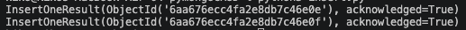
> <br><br>
> You can also check the output in MongoDB Compass:
> 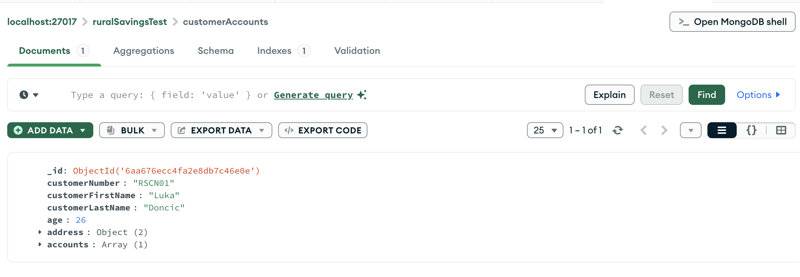
> 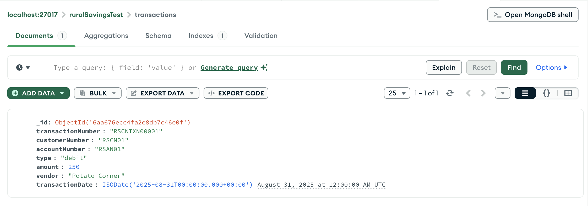

Okay, your turn.

>[!NOTE]
> **TO DO: Insert your own documents to the collection.**
> 1. Create 1 NEW customer and 1 NEW transaction of that customer using the same attributes. Make sure datatypes are correct.
> 2. Copy it into your DB Server and run your python code.
> 3. Check the results in MongoDB Compass.

Great, now let's try inserting multiple documents using `insert_many()`.

`insert_many()` is just like your `insert_one()` but you have to provide a list of dictionaries instead of just a dictionary. Still, it's better to put it in a variable first to make our code look cleaner.

On line 56-129 in the same code, we create a list variable called `customerAccountsDocuments` which contains 3 dictionaries for our 3 new customers.

The syntax for using `insert_many()` can be found on line 131.

>[!IMPORTANT]
> The `insert_many()` function accepts a python list of dictionaries as parameter, denoted by `[{}]`. Passing a dictionary will make the function fail.

>[!NOTE]
> **TO DO: Insert the documents to the collection.**
> 1. Copy and Paste lines 56-132 of `insert.py` to a blank python file in your local VSCode. 
> 2. Complete the code by adding any essential imports, open connection, and close connection code blocks in case they are not present.
> 3. Copy and paste your final code to a blank file in your EC2 server using nano.
> 4. Run the python code by executing `python3 <your_code_filename.py>`
><br><br>
> Expected Output is similar to this screenshot:
> 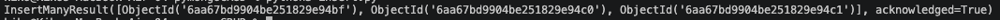
> <br><br>
> You can also check the output in MongoDB Compass:
> 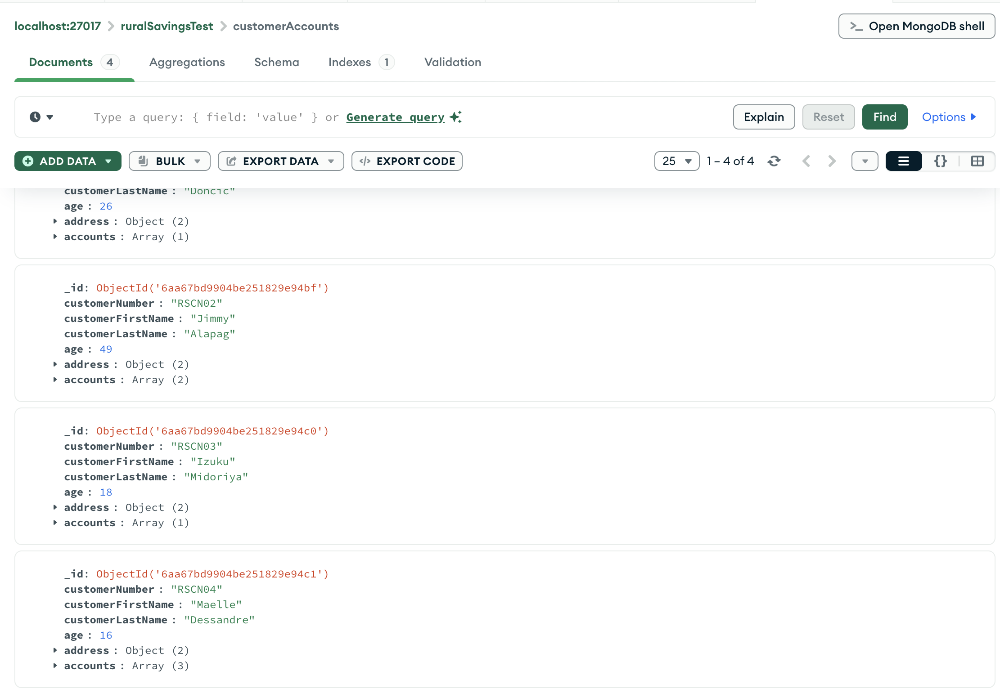

Your turn.

>[!NOTE]
> **TO DO: Insert your own documents to the collection.**
> 1. Create 10 NEW transactions for the 3 new customers using the same transaction attributes. Make sure datatypes are correct.
> 2. Copy it into your EC2 Server and run your python code.
> 3. Check the results in MongoDB Compass.

We mentioned in class that there are different types of numeric attributes that we can store in MongoDB:
- int: 32-bit integer  
- long: 64-bit integer  
- double: 64-bit floating-point number  
- decimal128: 128-bit decimal-based floating-point (for high-precision calculations like money)

For this demo, let's use the `test2` database.

>[!NOTE]
> **TO DO: Insert the special numeric documents to the collection.**
> 1. Copy and Paste lines 135-147 of `insert.py` to a blank python file in your local VSCode. 
> 2. Complete the code by adding any essential imports, open connection, and close connection code blocks in case they are not present.
> 3. Copy and paste your final code to a blank file in your EC2 server using nano.
> 4. Run the python code by executing `python3 <your_code_filename.py>`
> <br><br>
> You can check the output in MongoDB Compass (Notice the datatypes of each value in each document):
> 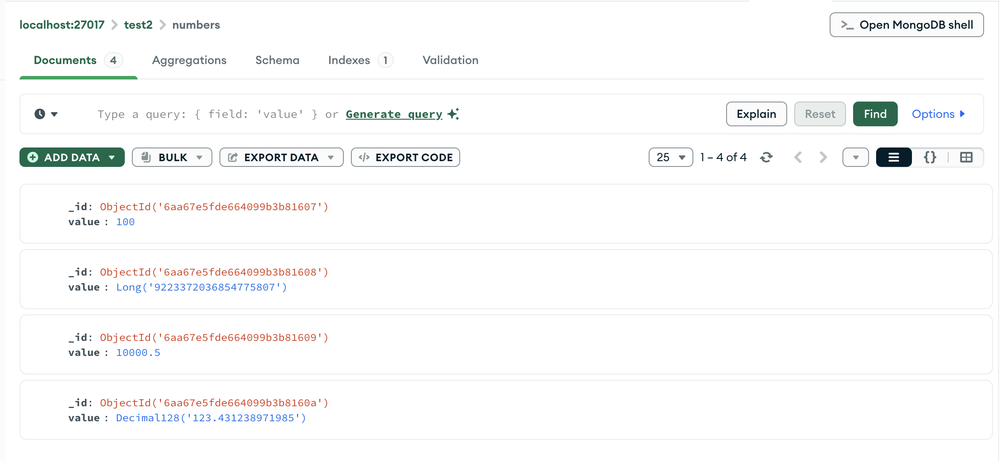

---

### `find.py`

To effectively make use of `find()` functions, we must have a significant number of documents in our collections. Thus, we'll be using what we've imported to our MongoDB database called `ruralSavingsPrime`. Make sure you have imported the data through `import.py`.

#### Basic query syntax

Same with inserting records, it is best to store our query in a dictionary variable first for a cleaner code structure.

For example, if you want to query customers with age >= 30 and lives in either Pasig or Taguig City, you can create the following query and store it in a variable:

```
query1 = {
    "age": { "$gt": 30 }, # Notice how the $gt operator is also enclosed in quotes unlike in mongosh
    "address.city": { "$in": ["Pasig", "Taguig"] } # Same here. This is because we are creating a python dictionary.
}
```

Similarly, querying can be done in 2 ways: `find_one()` and `find()` (many). Let's do `find_one()` first.

On lines 13-16 of the `find.py` python file, we create the query1 variable that contains our query above. Then, on lines 19-22, we call the function `find_one()` on the `ruralSavingsPrime.customerAccounts` collection and store the result to `results1`. We then print the results.

>[!NOTE]
> **TO DO: Execute `find_one()`.**
> 1. Copy and Paste lines 1-22 of `find.py` to a blank python file in your local VSCode. 
> 2. Complete the code by adding any essential imports, open connection, and close connection code blocks in case they are not present.
> 3. Copy and paste your final code to a blank file in your EC2 server using nano.
> 4. Run the python code by executing `python3 <your_code_filename.py>`
><br><br>
> Expected Output is similar to this screenshot (It should be exactly 1 document):
> 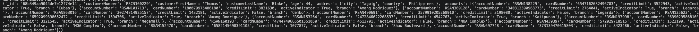

You should get exactly 1 result. Now modify your code and remove `_one` from `find_one`and rerun the code. What's the output?

It should say: <br>
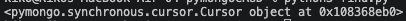

>[!IMPORTANT]
> This is called a **cursor** object. It's not a list, it's not a dictionary. A cursor object is basically an iterator that you can use to loop through the contents of the result. To print or access the results, simply use a `for..in` function in python.

To iterate through a cursor object, you can use the code block in lines 29-30:

```
for result in results2:
    print(result)
```

The output should be like this:<br>
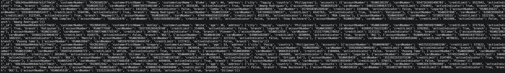

>[!NOTE]
> **TO DO: Execute a query.**
> 1. Using your previous querying knowledge, create a query that would show all transactions in 2024 with vendor="Canon" from the `ruralSavingsPrime.transactions` 
> 2. Print the result in the terminal and validate the output.

>[!NOTE]
> **TO DO: Execute a query.**
> 1. Using your previous querying knowledge, create a query that would show all customers with at least 1 account opened in the "Katipunan" branch from the `ruralSavingsPrime.customerAccounts` 
> 2. Print the result in the terminal and validate the output.

----

### `update.py`

To demonstrate updates, we will be using the same task in the previous lecture:

```
Update all debit transactions in 2019:
- Add the fraudTransactions value and set it toTrue (boolean). 
- Rename the vendor field to fraudVendor.
```

Similar to querying, updating can be done in 2 ways: `update_one` and `update_many`. Let's look at lines 13-25 of our `update.py` python script.

```
query1 = {
        "transactionDate": { '$gte': datetime(2019,1,1) },
        "transactionDate": { '$lt': datetime(2020,1,1) }
}

# create the update commands and store them in the updates1 variable
updates1 = {
    '$set': { 'fraudTransactions': True }, # Notice that the value True starts with a capital letter as compared to the value true in mongoDB which starts with a lowercase letter
    '$rename': { 'vendor': 'fraudVendor' }
}

# execute the update
db['transactions'].update_one(query1, updates1) # We are only passing 2 parameters since we don't want to specify any options
```

Just like the previous operations, it's best to store the parameters of update functions in variables first before running the command for a cleaner code.

In the code above, the query parameter is stored in `query1`, while the update parameter is stored in `update1`.

>[!IMPORTANT]
> The update_one() and update() functions accept 3 dictionaries as parameters. The first dictionary is the query which will be used to filter documents that will be updated. The second dictionary is the updates and renames, and the third and optional dictionary is the options. For code readability, we will declare the dictionaries as separate variables.

>[!NOTE]
> **TO DO: Execute `update_one()`.**
> 1. Copy and Paste lines 1-25 of `update.py` to a blank python file in your local VSCode. 
> 2. Complete the code by adding any essential imports, open connection, and close connection code blocks in case they are not present.
> 3. Copy and paste your final code to a blank file in your EC2 server using nano.
> 4. Run the python code by executing `python3 <your_code_filename.py>`
> 5. Go to MongoDB Compass, navigate to your `ruralSavingsPrime.transactions` collection and run the following query<br>
> ```
>{
>        "transactionDate": { "$gte": ISODate("2019-01-01") },
>        "transactionDate": { "$lt": ISODate("2020-01-01") }
>}
>```
> Expected Output should be similar to this screenshot (only one has `fraudTransactions: true` attribute):
> 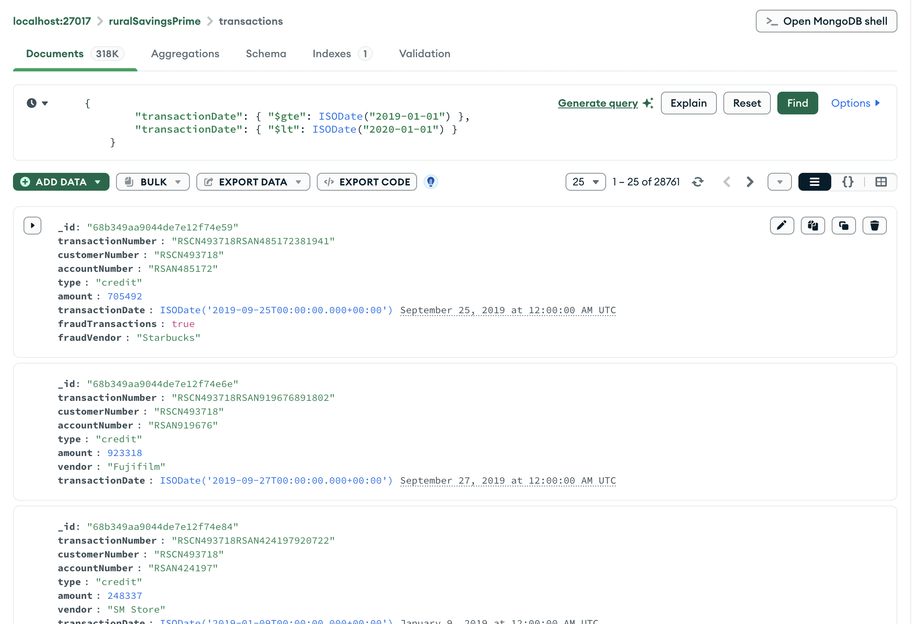

Now, try changing `update_one()` to `update_many()` and do the same steps above to check the results. All documents should already be updated like the image below:

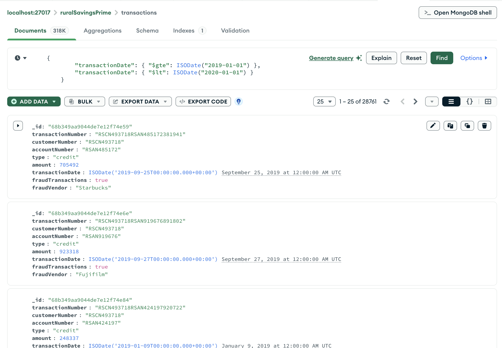

>[!NOTE]
> **TO DO: Execute an update.**
> 1. Using your previous updating knowledge, update all customers in `ruralSavingsPrime.customerAccounts` with at least 1 account opened in the "Katipunan" branch to include the `profile` attribute with the value `"Probably Atenean"`. The new attribute must be under the customer's details, not the account's.
> 2. Validate the output in MongoDB Compass.

---

### `delete.py`

Using the previous fraud transactions that we updated, it's best to delete them to avoid any confusion within our `transactions` table. Let's do that using the delete functions in pymongo.

Like the update functions, delete also has 2 functions: `delete_one()` and `delete_many()`. By now, you should already know the difference of the 2.

> [!IMPORTANT]
> The delete_one() and delete() functions accept 1 dictionary as parameter. You just need to provide a query and all documents that match that query will be deleted (if using delete_many()).

Take a look at lines 12-26 in our `delete.py` python code:

```
# Let's declare our query
query1 = {
    'fraudTransactions': True
}

# You may also use different variations of this query, as long as the logic is correct
query2 = {
    'fraudVendor': { '$exists': True }
}

# Or use the same query for updating the records, this will also work
query3 = {
    "transactionDate": { '$gte': datetime(2019,1,1) },
    "transactionDate": { '$lt': datetime(2020,1,1) }
}
```

These 3 different queries pertain to the same exact set of documents.

> [!WARNING]
> Before running any delete operations, make sure your query is correct. Running a find operation before deleting is a good practice.

>[!NOTE]
> **TO DO: Execute the delete functions.**
> 1. Using the provided queries, use one to execute `delete_one()` and use another to execute `delete_many()`.
> 2. Validate the output in MongoDB Compass.