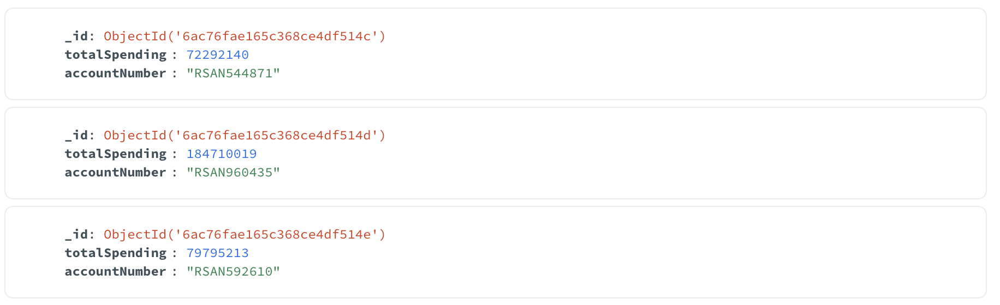

# [05] Aggregation Pipelines

## Introduction

In this lecture, you will learn how to create and execute MongoDB Aggregation Pipelines using Pymongo. Keep in mind that running the same pipeline here in mongosh will yeild the same results, which is why we won't demonstrate that anymore. You are free to try it out by yourself.

## Code Structure

This code is broken down into different python scripts.

There are 3 scripts: `utils.py`, `main.py`, and `aggregations.py`. `utils.py` contains functions that establish and destroy connections to mongoDB. `main.py` is our main python code where all function calls are made in sequence. And `aggregations.py` will contain functions that execute our Aggregation Pipelines.

It was designed this way for brevity.

Always watch out for comments that look like these:

```
"""
this is a comment
"""
```

or

```
# this is another comment
```

as they would give you information on what is being done or instructions on what to do next. Comments marked with `TODO` needs action from your side in order to complete the code.

## Reverting to the Original Database State

If you want to revert to the original database state before starting this activity, you may drop the database and execute `import.py` again.

```
use ruralSavingsPrime;
db.dropDatabase();
```

---
---
<br/><br/>

# MongoDB Aggregation Pipelines

In this section, we will go through the process of creating and executing an Aggregation Pipeline in MongoDB.

## Basic Syntax

First, we need to connect to MongoDB using the `MongoClient()` function.

```
from utils import *

def myFirstAggPipeline():
    conn = openConnection()
    db = conn['ruralSavingsPrime']
```

`myFirstAggPipeline()` is the function we will use to connect to MongoDB, create a pipeline, and run it. Note: We must call this function in order to execute the pipeline. If you don't nothing will happen.

Then, we need to create our Aggregation Pipeline. As mentioned in class, an Aggregation Pipeline is a dictionary list. Each stage is a dictionary, and the sequence of these stages creates the pipeline.

```
from utils import *

def myFirstAggPipeline():
    conn = openConnection()
    db = conn['ruralSavingsPrime']

    pipeline = [{}] # a pipeline is a list of dictionaries
```

Finally, we can call the Pymongo `aggregate()` function to execute our pipeline.

```
from utils import *

def myFirstAggPipeline():
    conn = openConnection()
    db = conn['ruralSavingsPrime']

    pipeline = [{}] # a pipeline is a list of dictionaries

    db['transactions'].aggregate(pipeline)
```

## Aggregation Pipeline Syntax

As mentioned, Aggregation Pipelines are composed of stages. Each stage is an object. Thus, an aggregation pipeline would look like this:

```
pipeline = [
    { <stage1> },
    { <stage2> },
    { <stageN> }
]
```

**NOTE: The maximum number of stages that you can add in a pipeline is 1000. Exceeding this limit will result into an error.**

**Don't forget to run your pipeline by using the `.aggregate()` function in python!**

## Stages

### $match - filtering documents

There are different stages we can use to transform our data. Let's start with `$match`. `$match` is the same as find(). If you use match in a pipeline, the resulting dataset will output documents that match your criteria. This is the syntax:

```
pipeline = [
    {
        '$match': {
            'age': { '$gte': 30, '$lte': 40 },
            'address.city': 'Taguig'
        }
    }
]
```

Keep in mind that aggregation stages are always enclosed in `{}`. A stage also accepts an object as its value. Notice how the query parameters are also enclosed in `{}`.

Whatever is inside the `$match` value object will be considered as your query conditions. Everything in your `find()` function lecture should work within this object, as their goals are the same: query and filter.

### $sort - sorting result datasets

#### Basic Sorting

Once we have queried the documents we need, we might need them to be in a particular order. We may need them in ascending order to get the bottom result relative to a particular value, or the top result using a descending order.

To achieve this, we can use the `$sort` stage. This is the syntax:

```
pipeline = [
    {
        '$sort': {
            `age`: 1
        }
    }
]
```

#### Changing the Sort Direction

This `$sort` stage will sort your documents in the ascending order. Replacing `1` with `-1` will sort the documents in descending order.

Thus, if we want to `$sort` the results of our matched documents above, we can do create this pipeline:

```
pipeline = [
    {
        '$match': {
            'age': { '$gte': 30, '$lte': 40 },
            'address.city': 'Taguig'
        }
    },
    {
        '$sort': {
            'age': 1
        }
    }
]
```

In this sequence, the pipeline filters the documents in the collection first, before sorting the `$match` stage's results. If you reverse the order, then the sorting will be executed first before the filtering.

#### Sorting Using Multiple Attributes

Multiple attributes can be used to sort objects. See this example below where the documents in our `$transactions` collection is sorted by amount, ascending and transactionDate, descending:

```
pipeline = [
    {
        '$sort': {
            'amount': 1,
            'tranactionDate': -1
        }
    }
]
```

### $group - aggregating results

#### Basic Group Stage

Let's say you need to get the total amount of transactions for each account from the `ruralSavingsPrime.transactions` collection. You can achieve that using `$group`. Here is the syntax:

```
pipeline = [
    {
        '$match': {
            'type': 'debit'
        }
    },
    {
        '$group': {
            '_id': '$accountNumber',
            'totalSpending': {
                '$sum': '$amount'
            }
        }
    }
]
```

#### Referencing Attribute Values in a Stage

>[!IMPORTANT]
> **Wait!** Why does the field names now have `$` signs? When using them in the `$match` stage, we didn't have to include them, right?
> This is because in the `$group` stage, we are **referencing** the value of the attribute (accountNumber). If you are comparing existing fields with conditions like in the `$match` stage, you don't need the `$` sign.

#### Group Operations

Aside from `$sum`, there are also other aggregation operations like `$avg`, `$min`, `$max` which are pretty descriptive of what they do to your data.

>[!IMPORTANT]
> Since the `$group` stage requires `_id` to receive the value of the attribute you intend to group by with, the original `_id` values will be dropped. This is logical since you are grouping by the new `_id`, not the old `_id`.

#### Grouping by Multiple Attributes

You can also group by multiple attributes by creating multiple key-value pair object inside the _id field. See example below:

```
pipeline = [
        {
            '$group': {
                '_id': {
                    'accountNumber': '$accountNumber',
                    'type': '$type',
                    'vendor': '$vendor'
                },
                'totalSpendingByType': {
                    '$sum': '$amount'
                }
            }
        }
    ]
```

This operation groups by accountNumber, type, and vendor. The output would look like this:

```
...
{'_id': {'accountNumber': 'RSAN219919', 'type': 'credit', 'vendor': 'Fujifilm'}, 'totalSpendingByType': 11211700}
{'_id': {'accountNumber': 'RSAN476446', 'type': 'credit', 'vendor': 'Arabica'}, 'totalSpendingByType': 11132275}
{'_id': {'accountNumber': 'RSAN873199', 'type': 'debit', 'vendor': 'Sony'}, 'totalSpendingByType': 3863910}
{'_id': {'accountNumber': 'RSAN785539', 'type': 'debit', 'vendor': 'Shakeys'}, 'totalSpendingByType': 5825308}
...
```

>[!IMPORTANT]
> Since `_id` is an object, how do you flatten it such that the fields used for grouping will be its own attribute instead of an object instead of an `_id`? You can use the `$project` stage which is discussed in the next section.

### $project - limiting the output fields

#### Basic Project Stage (Inclusion and Exclusion of Attributes)

Our output in the previous pipelines may be enough for us in terms of format. But what if you only want to retain certain fields? Or even add new fields?

The `$project` stage allows us to do these things. We can include or exclude certain fields, and even add new fields to our output dataset. However, you cannot perform inclusion and exclusion in 1 stage except if you are excluding the `_id` field. You need 2 `$project` stages if you want to do both. So my advise is, just pick 1 method in your `$project` stage.

So this:

```
pipeline = [
    {
        '$project': {
            'age': 0,
            'customerNumber': 1,
            'customerName': 0
        }
    }
]
```

is not valid. While this:

```
pipeline = [
    {
        '$project': {
            'age': 1,
            'customerNumber': 1,
            'customerName': 1,
            '_id': 0
        }
    }
]
```

is valid.

#### Using Project to Format Schemas

To format our output with the following schema:

```
{ 'totalSpending': xxxxx, 'accountNumber': 'xxxxx'}`
```

we run:

```
pipeline = [
    {
        '$match': {
            'type': 'debit'
        }
    },
    {
        '$group': {
            '_id': '$accountNumber',
            'totalSpending': {
                '$sum': '$amount'
            }
        }
    },
    {
        '$project': {
            '_id': 0,
            'totalSpending': 1,
            'accountNumber': '$_id'
        }
    }
]
```

In this `$project` stage, we removed the `_id` field and transfered its value to the `accountNumber` field which is a new field for our results to look better.

>[!IMPORTANT]
>Once you exclude fields in a `$project` stage, they will be gone for the rest of the pipeline. So make sure you are only dropping what you really intend to drop.

#### Using Project to Rename Fields

You can also use the `$project` stage to rename fields. For instance, if you want to rename the `vendor` field to `merchant`, you can use the following stage:

```
pipeline = [
    {
        '$project': {
            'transactionNumber': 1,
            'customerNumber': 1,
            'accountNumber': 1,
            'type': 1,
            'amount': 1,
            'merchant': '$vendor',
            'transactionDate': 1
        }
    }
]
```

#### Using Project to Flatten Objects

In the previous `$group` stage, we said that grouping with multiple attributes produces an `_id` field that is in object form like this:

```
...
{'_id': {'accountNumber': 'RSAN219919', 'type': 'credit', 'vendor': 'Fujifilm'}, 'totalSpendingByType': 11211700}
{'_id': {'accountNumber': 'RSAN476446', 'type': 'credit', 'vendor': 'Arabica'}, 'totalSpendingByType': 11132275}
{'_id': {'accountNumber': 'RSAN873199', 'type': 'debit', 'vendor': 'Sony'}, 'totalSpendingByType': 3863910}
{'_id': {'accountNumber': 'RSAN785539', 'type': 'debit', 'vendor': 'Shakeys'}, 'totalSpendingByType': 5825308}
...
```

To flatten our _id field and make these results follow this schema, we can use this pipeline below. Take note of the last stage which is the project stage.

```
pipeline = [
    {
        '$group': {
            '_id': {
                'accountNumber': '$accountNumber',
                'type': '$type',
                'vendor': '$vendor'
            },
            'totalSpendingByType': {
                '$sum': '$amount'
            }
        }
    },
    {
        '$project': {
            '_id': 0, #remove the _id field
            'accountNumber': '$_id.accountNumber',
            'type': '$_id.type',
            'vendor': '$_id.vendor',
            'totalSpendingByType': 1
        }
    }
]
```

This will yield the following output or something similar (attribute order may change):

```
...
{'totalSpendingByType': 3633400, 'accountNumber': 'RSAN773988', 'type': 'credit', 'vendor': 'Sony'}
{'totalSpendingByType': 867374, 'accountNumber': 'RSAN458792', 'type': 'credit', 'vendor': 'Shakeys'}
{'totalSpendingByType': 5605009, 'accountNumber': 'RSAN437497', 'type': 'debit', 'vendor': 'Big Camera'}
{'totalSpendingByType': 1220355, 'accountNumber': 'RSAN620539', 'type': 'debit', 'vendor': 'McDonalds'}
{'totalSpendingByType': 6404113, 'accountNumber': 'RSAN247017', 'type': 'debit', 'vendor': 'EasyPC'}
{'totalSpendingByType': 2213449, 'accountNumber': 'RSAN904206', 'type': 'credit', 'vendor': 'SM Store'}
{'totalSpendingByType': 6395531, 'accountNumber': 'RSAN955095', 'type': 'credit', 'vendor': 'CoffeeNow'}
...
```

### $limit - limiting the number of output documents

In SQL, we all know what the `limit` clause does to query results. It limits the number of records the query returns. It's the same thing in MongoDB Aggregation Pipelines. If, for some reason, you need to limit the number of documents your pipeline returns, then this is the right stage for you.

To perform a limit, this is the syntax:

```
pipeline = [
    {
        '$limit': 100
    }
]
```

This stage limits the output documents to 100.

### $out - Outputs the pipeline results to a collection

#### Basic Out Stage

The `$out` stage allows you to store the output of your Aggregation Pipeline to a collection. 

>[!IMPORTANT]
> Take note though that this stage is **desctructive**. Using `$out` to store the output to a non-empty collection will replace its contents. Thus, always be careful when using this stage.

If we want to output our spending aggregation dataset to a `spenders` collection in the same database, here's how we do it:

```
pipeline = [
    {
        '$match': {
            'type': 'debit'
        }
    },
    {
        '$group': {
            '_id': '$accountNumber',
            'totalSpending': {
                '$sum': '$amount'
            }
        }
    },
    {
        '$project': {
            '_id': 0,
            'totalSpending': 1,
            'accountNumber': '$_id'
        }
    },
    {
        '$out': 'spenders'
    }
]
```

>[!IMPORTANT]
> When you inserted the results to the collection spenders, what did you notice about the output?
> 
> If you go back to our pipeline, we already set `_id` to 0 but when the `$out` stage was used, new `_id` values were generated.
> This is due to the nature of inserting records to a collection. Recall that inserting to a collection without specifying an `_id` field will allow MongoDB to generate one for you. If you want another value to be your `_id`, then you must fix it in a `$project` stage before you use the `$out` stage.

#### Using the Out Stage to Output to a Different Database

If we want to output the results to a collection in a different database, here's how we do it:

```
pipeline = [
    {
        '$match': {
            'type': 'debit'
        }
    },
    {
        '$group': {
            '_id': '$accountNumber',
            'totalSpending': {
                '$sum': '$amount'
            }
        }
    },
    {
        '$project': {
            '_id': 0,
            'totalSpending': 1,
            'accountNumber': '$_id'
        }
    },
    {
        '$out': {
            'db': 'ruralSavingsPrimeAnalytics',
            'coll': 'spenders'
        }
    }
]
```

This outputs the result to the `spenders` collection in the `ruralSavingsPrimeAnalytics` database.

>[!IMPORTANT]
> When using `$out`, make sure you are providing an `_id` field that has unique values. You may also remove the `_id` field so that the `$out` stage generates them for you. Otherwise, you'll encounter an error.

### $unwind - Deconstructs arrays

The `$unwind` stage allows you to expand arrays into multiple documents. We all know by now that an array is a data structure that contains multiple values. Let's take the customer-account relationship as an example. We embedded the accounts in the customers collection and it looks like this:

```
{
    'customerNumber': 'C123',
    'accounts': [
        {
            'accountNumber': 'A123'
        },
        {
            'accountNumber': 'A456'
        }
    ]
}
```

What if we want to have 1 document per account using this collection? We can use the `$unwind` stage to make it look like this:

```
{ 'customerNumber': 'C123', 'accounts': { 'accountNumber': 'A123' } },
{ 'customerNumber': 'C123', 'accounts': { 'accountNumber': 'A456' } }
```

To do this, we can use the following script:

```
pipeline = [
    {
        '$unwind': '$accounts'
    }
]
```

>[!IMPORTANT]
> When you unwind an array, it uses the _id value of the outer object. In our case, the customerNumber will be used as the _id value. You cannot insert this directly to a collection as it will return a duplicate key error. Make sure to use the `$project` stage to change the value of the _id field and make it unique.


### $lookup - Performs one-to-one or one-to-many joins

We say that embedding is the best way to go in terms of data modeling in document databases. But what if we had a compelling reason not to embed? For instance, we cannot embed our transactions into the `customerAccounts` collection because of the 16 MB limit and the "One-to-Squillion" relationship between the 2?

We can always perform a `$lookup` stage in aggregation pipelines. As the name implies, if performs a lookup from a base collection (left table in SQL join) and a lookup collection (right table in SQL join).

>[!IMPORTANT]
>We must always limit the lookups that we perform in production applications as this can take up compute power and also time to complete a single `$lookup` aggregation stage. The only way to check if our production lookups make sense is through load testing, or the process of testing big data with our aggregation pipelines before production deployments.**

This is the syntax of the `$lookup` stage:

```
pipeline = [
    {
        '$lookup': {
            'from': 'customerAccounts',
            'localField': 'customerNumber',
            'foreignField': 'customerNumber',
            'as': 'transactions'
        }
    }
]
```

>[!IMPORTANT]
> The output object (in the case above, transactions) will always be in array form even if it is a 1:1 match. Thus, you always need to unwind after lookup to access the array objects effectively. Unless you will directly access each index.

That's it! Let's now put together a simple aggregation pipeline for our test data. (Of course we won't be using all stages in this scenario)

Scenario:
- As a credit scorer in ruralSavings, you would like to get the top and bottom spender.
- You need to create 1 aggregation pipeline for the top spender, and 1 for the bottom spender, and output them to 2 different collections — “creditScoreRawTop” and "creditScoreRawBottom", respectively.
- The output collection should have the following schema:
```
{
    '_id': ObjectId('xxxx'), #note: this should be a generated _id upon creation of creditScoreRawTop
    'customerFirstName': 'xxxx',
    'customerLastName': 'xxxx',
    'customerSpend': xxxxx
}
```

Note: A transaction is considered spending if the transactionType is “debit”.

Let's create the creditScoreRawTop collection first:

1. Use the transactions collection to calculate the spending of each customer.

```
    pipeline = [
        {
            '$match': {
                'type': 'debit'
            }
        },
        {
            '$group': {
                '_id': '$customerNumber',
                'customerSpend': {
                    '$sum': '$amount'
                }
            }
        }
    ]
```

2. Sort the output in descending order and limit the results to 1.

```
    pipeline = [
        {
            '$match': {
                'type': 'debit'
            }
        },
        {
            '$group': {
                '_id': '$customerNumber',
                'customerSpend': {
                    '$sum': '$amount'
                }
            }
        },
        {
            '$sort': {
                'customerSpend': -1
            }
        },
        {
            '$limit': 1
        }
    ]
```

3. Lookup to the customerAccounts collection to get the customer object that is related to the top spender.

```
    pipeline = [
        {
            '$match': {
                'type': 'debit'
            }
        },
        {
            '$group': {
                '_id': '$customerNumber',
                'customerSpend': {
                    '$sum': '$amount'
                }
            }
        },
        {
            '$sort': {
                'customerSpend': -1
            }
        },
        {
            '$limit': 1
        },
        {
            '$lookup': {
                'from': 'customerAccounts',
                'localField': '_id',
                'foreignField': 'customerNumber',
                'as': 'customer'
            }
        }
    ]
```

4. Since the output of any `$lookup` stage is always an array, we must unwind first.

```
    pipeline = [
            {
                '$match': {
                    'type': 'debit'
                }
            },
            {
                '$group': {
                    '_id': '$customerNumber',
                    'customerSpend': {
                        '$sum': '$amount'
                    }
                }
            },
            {
                '$sort': {
                    'customerSpend': -1
                }
            },
            {
                '$limit': 1
            },
            {
                '$lookup': {
                    'from': 'customerAccounts',
                    'localField': '_id',
                    'foreignField': 'customerNumber',
                    'as': 'customer'
                }
            },
            {
                '$unwind': '$customer'
            }
    ]
```

5. Format the output according to what is asked: customerNumber, customerFirstName, customerLastName, customerSpend (in any order).

```
    pipeline = [
        {
            '$match': {
                'type': 'debit'
            }
        },
        {
            '$group': {
                '_id': '$customerNumber',
                'customerSpend': {
                    '$sum': '$amount'
                }
            }
        },
        {
            '$sort': {
                'customerSpend': -1
            }
        },
        {
            '$limit': 1
        },
        {
            '$lookup': {
                'from': 'customerAccounts',
                'localField': '_id',
                'foreignField': 'customerNumber',
                'as': 'customer'
            }
        },
        {
            '$unwind': '$customer'
        },
        {
            '$project': {
                '_id': 0,
                'customerNumber': '$_id',
                'customerFirstName': '$customer.customerFirstName',
                'customerLastName': '$customer.customerLastName',
                'customerSpend': 1
            }
        }
    ]
```

6. Output to the collection `creditScoreRawTop`.

```
    pipeline = [
        {
            '$match': {
                'type': 'debit'
            }
        },
        {
            '$group': {
                '_id': '$customerNumber',
                'customerSpend': {
                    '$sum': '$amount'
                }
            }
        },
        {
            '$sort': {
                'customerSpend': -1
            }
        },
        {
            '$limit': 1
        },
        {
            '$lookup': {
                'from': 'customerAccounts',
                'localField': '_id',
                'foreignField': 'customerNumber',
                'as': 'customer'
            }
        },
        {
            '$unwind': '$customer'
        },
        {
            '$project': {
                '_id': 0,
                'customerNumber': '$_id',
                'customerFirstName': '$customer.customerFirstName',
                'customerLastName': '$customer.customerLastName',
                'customerSpend': 1
            }
        },
        {
            '$out': 'creditScoreRawTop'
        }
    ]
```

And there you have it! You have your `creditScoreRawTop` collection which contains your top spender. 

You can see the full python code in the creditScorer.py file in this repository.

Now, to generate the `creditScoreRawBottom` collection for the bottom spender, you only need to change 1 stage. Can you guess which one?